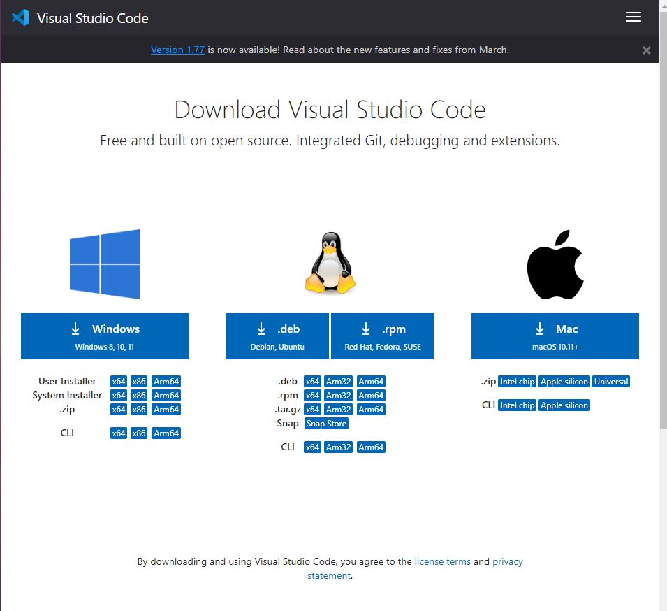
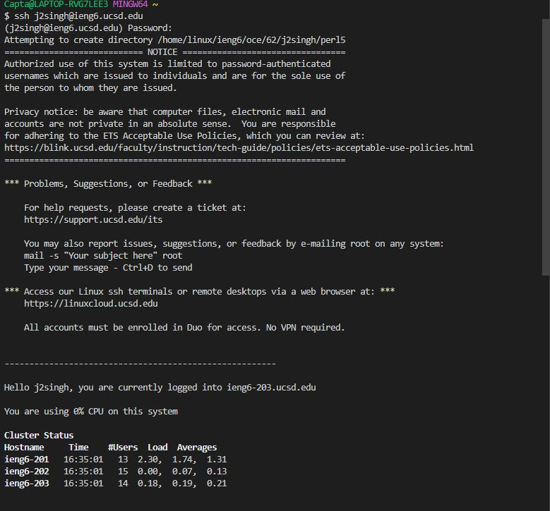

# Lab Report 1
**How to log in to remote access**

## Step 1: Download Visual Studio Code

Download the version of Visual Studio Code which is required for your operating system.

## Step 2 : Install Git and use Bash on Windows in VS Code

[Git for Windows](https://gitforwindows.org/)

[Using Base on Windows in VScode](https://stackoverflow.com/a/50527994)

## Step 3 : Login to ssh
First we have to get access to your course-specified CSE15L account here:

[Account](https://sdacs.ucsd.edu/~icc/index.php)

To use ssh, open a terminal in VScode. Your command will look like this but with the first part behind the @ being the course specified login (cs15l....):\
$ ssh cs15lwi23zz@ieng6.ucsd.edu\
It will prompt you to enter password, but it will **NOT** appear to be typing in terminal. This is for security reasons.\
Since this is the first time you will connect to the server you will get prompted a message like this:\
*The authenticity of host 'ieng6.ucsd.edu (128.54.70.227)' can't be established.
RSA key fingerprint is SHA256:ksruYwhnYH+sySHnHAtLUHngrPEyZTDl/1x99wUQcec.
Are you sure you want to continue connecting (yes/no/[fingerprint])?*\
Type **Yes** and enter, then enter your password.

An example of what should pop up in terminal:\
\
(This example uses my UCSD login rather than course specific but it looks the same with the course specific login)
## Step 4 : Run Some Commands

Try running the commands cd, ls, pwd, mkdir, and cp a few times in different ways, both on your computer, and on the remote computer after ssh-ing (use the terminal in VScode).

Here are some specific useful commands to try:

-cd ~\
-cd\
-ls -lat\
-ls -a\

## Step 5 : Logout of Server
In order to log out of the remote server in your terminal, you can use:

-Ctrl-D\
-Run the command: exit
