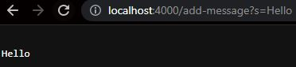
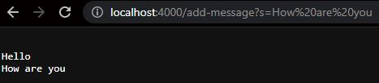
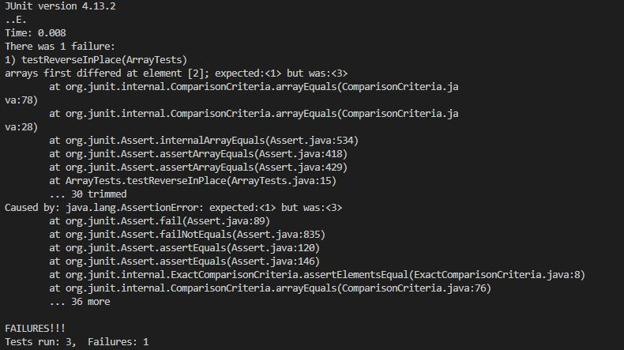

# Lab Report 2

##Code for StringServer

~~~
import java.io.IOException;
import java.net.URI;

class Handler implements URLHandler {
    String string = "";

    public String handleRequest(URI url){
        if (url.getPath().equals("/")){
            return String.format("%s", string);
        } else {
            System.out.println("Path: " + url.getPath());
            if (url.getPath().contains("/add-message")){
                String[] parameters = url.getQuery().split("=");
                string = string + "\n" + parameters[1];
                return String.format("%s", string);
            }
            return "404 Not Found!";
        } 
        
    }
}
class StringServer {
    public static void main(String[] args) throws IOException {
        if(args.length == 0){
            System.out.println("Missing port number! Try any number between 1024 to 49151");
            return;
        }

        int port = Integer.parseInt(args[0]);

        Server.start(port, new Handler());
    }
}
~~~

## Using add-message

1) Which methods in your code are called?\
- The method called is: 'handleRequest(URI url)' of the 'Handler' class.\
2) What are the relevant arguments to those methods, and the values of any relevant fields of the class?\
- The argument 'URL' is a url object representing the incoming request with the path '/add-message' and query string 'Hello.'\
3) How do the values of any relevant fields of the class change from this specific request? If no values got changed, explain why.\
- The field 'string' is originally an empty string, but is updated to "Hello" once the command is run.\

1) Which methods in your code are called?\
- The method called is: 'handleRequest(URI url)' of the 'Handler' class.\
2) What are the relevant arguments to those methods, and the values of any relevant fields of the class?\
- The argument 'URL' is a url object representing the incoming request with the path '/add-message' and query string 'How are you.'\
3) How do the values of any relevant fields of the class change from this specific request? If no values got changed, explain why.\
-The field 'string' is originally the string "Hello", but is updated to "Hello" followed by "How are you" once the command is run.\

## Choosing a bug from Lab 3

Failure-inducing test:
~~~
public class ArrayTests {
	@Test 
    int[] input2 = {1, 2, 3};
    ArrayExamples.reverseInPlace(input2);
    assertArrayEquals(new int[]{3, 2, 1}, input2);
	}

~~~
Non-Failure-inducing test: 
~~~
public class ArrayTests {
	@Test 
	public void testReverseInPlace() {
    int[] input1 = { 3 };
    ArrayExamples.reverseInPlace(input1);
    assertArrayEquals(new int[]{ 3 }, input1);
	}
~~~

Symptom:\

Code with bug:
~~~
public class ArrayExamples {

  // Changes the input array to be in reversed order
  static void reverseInPlace(int[] arr) {
    for(int i = 0; i < arr.length; i += 1) {
      arr[i] = arr[arr.length - i - 1];
    }
  }
~~~

Code with bug fixed: 
~~~
// Changes the input array to be in reversed order
  static void reverseInPlace(int[] arr) {
    for(int i = 0; i < arr.length / 2; i++) {
      int temp = arr[i];
      arr[i] = arr[arr.length - 1 - i];
      arr[arr.length - 1 - i] = temp;
    }
  }
~~~

Reason code was not working:
The original code with the bug was flipping the input twice. It was not noticable with the first test because it only had one element. Adding the test with more numbers allowed you to see that the code was flipping the Array twice. By adding a temporary variable and dividing the length of the argument by 2, you stop the Array from being flipped twice as it only flips to the middle element of the array. Of course, the middle element of the array does not need to be flipped, fixing the bug.\
## Something I learned in week 2 or 3.

The main thing I learned in these last weeks that really blew my mind was creating a website and writing code that changed the website using a URL. Slowly, how websites truly work that we use everyday are starting to make sense to me in terms of the code that is required to run them. I found it absoltely fascinating that I was able to create a Server that would update a string with the URL as I did in this lab. 
