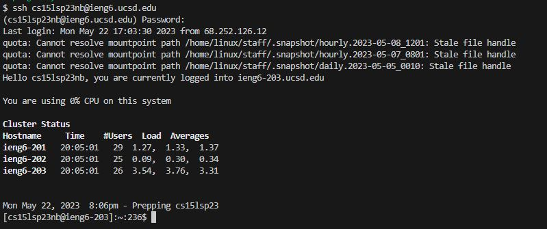
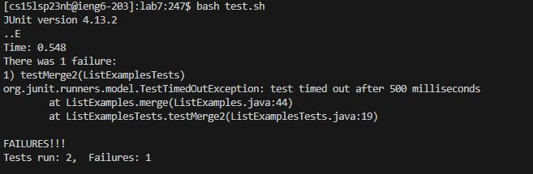
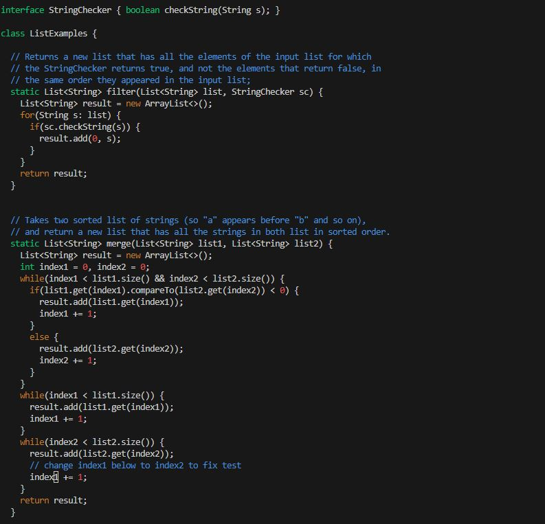
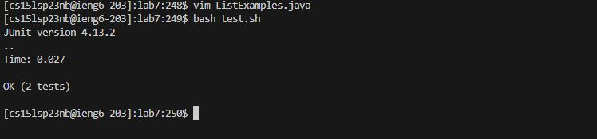
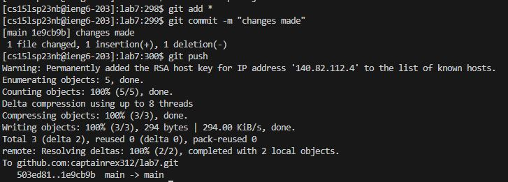

# LabReport 4

## Step 1 : Log into ssh ieng6

Keys pressed: typed in my cs account
~~~
ssh cs15lsp23nb@ieng6.ucsd.edu <enter>
~~~
~~~
(type in password when prompted) <enter>
~~~
## Step 2 : Clone your fork of the repository from your Github account

~~~
git clone (GITHUB URL) <enter>
~~~

## Step 3 : Run tests to show they fail

Keys pressed: (runs the tests)
~~~
bash test.sh <enter>
~~~

## Step 4: Edit the code to fix the failing test

Open the file in order to edit the code by using the command :
~~~
vim ListExamples.java <enter>
~~~
Type in :
~~~
?index1 <enter>
~~~
to search for index 1 from the bottom up. This will immediately go to the correct one that we need to alter.\
Next, type :
~~~
wq <enter>
~~~
and press the left arrow twice, 
~~~
<left><left>
~~~
in order to get to the "1"\
Press "x" to remove the "1", followed by pressing "i" to enter insert mode. Type "2" in order to add it correctly.\
Press escape to exit insert mode.\
Type :
~~~
:wq <enter>
~~~

## Step 5 : Run tests to show they pass
  

Keys pressed: (runs the tests)
~~~
bash test.sh <enter>
~~~

## Step 6 : Commit and push to github
  

Keys pressed: (commit and push)
~~~
git add * <enter>
~~~
(adds file contents to the index)
~~~
git commit -m "changes made" <enter>
~~~
(commits and you need to type a commit message as well)
~~~
git push <enter>
~~~
(pushes changes to github)
