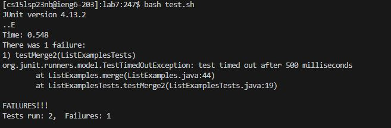

# Lab Report 5

## Original EdStem Post

**What environment are you using (computer, operating system, web browser, terminal/editor, and so on)?**
In my ssh on VSCode. 

**Detail the symptom you're seeing. Be specific; include both what you're seeing and what you expected to see instead. Screenshots are great, copy-pasted terminal output is also great. Avoid saying “it doesn't work”.**

My tests keep failing and I cannot seem to figure out the bug. I don't understand what the error message is telling me either. I think I need another set of eyes to help.

**Detail the failure-inducing input and context. That might mean any or all of the command you're running, a test case, command-line arguments, working directory, even the last few commands you ran. Do your best to provide as much context as you can.**

When running my test command (bash test.sh), I am getting a failure with not a lot of information on how to fix it.

## TA reponse

Hello Student!
The error message actually tells you where the issue is in your code! That is what ListExamples.merge(ListExamples.java:44) means, it is in line 44 of that file. If you look at your code, it appears you should be adding to index2 in that final while loop instead of index 1. The next part of the error message, ListExamplesTests.testMerge2(ListExamplesTests.java:19), tells you that line 19 of your test code is where the failure occurs. 

Now that we know where the issue is, you need to go back into the file and resolve it!
We can easily do this by entering vim on VSCode. Type vim (file you want to edit) in terminal in order to view the file and have the ability to edit it. Pan over to where the error is, in this case line 44, and click "x" on the 1 in index1 to remove the 1, followed by "i" to enter insert mode and add that 2 in. The code should fix with this, goodluck!

## Part 2 - Reflection
I found using Vim in VSCode to be the most interesting thing I learned in the second half of the quarter. It was really confusing at first, especially navigating it with the letters rather than using arrow keys which took a while to get used to. But, there are so many commands that make debugging and editting your code so much easier. For example, looking for a specific part of your code by using a ? absolutely blew my mind! It literally takes you to exactly where you need to be and edit the code perfectly. I look forward to using Vim in the future to edit my code! 
